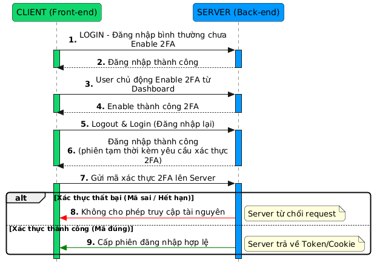

# 🏦 Banking System – Software Architecture Improvements

## 1. Giới thiệu về hệ thống

## 1.1. Bối cảnh & Hệ thống gốc

Dự án ban đầu là một hệ thống **Banking Monolith** cơ bản, được xây dựng trên nền tảng **Node.js** và **Prisma ORM**. Hệ thống đã đáp ứng đầy đủ các nghiệp vụ ngân hàng cốt lõi (Functional Requirements) bao gồm:

- Đăng ký / Đăng nhập (Authentication).
- Xem số dư & Thông tin tài khoản.
- Giao dịch chuyển tiền.
- Xem lịch sử giao dịch.

Tuy nhiên, sau khi đánh giá kiến trúc, chúng tôi nhận thấy hệ thống còn khá **"ngây thơ"**. Hệ thống được thiết kế chỉ để "chạy được tính năng" trong điều kiện lý tưởng mà hoàn toàn bỏ qua các **yêu cầu phi chức năng** quan trọng như: khả năng chịu tải, tính toàn vẹn dữ liệu (Data Integrity) và các kịch bản lỗi mạng thực tế.

---

## 1.2. Các vấn đề nghiêm trọng

Trước khi tiến hành cải tiến, hệ thống tồn tại 4 vấn đề "chí mạng" có thể dẫn đến sập server hoặc sai lệch tài sản người dùng bất cứ lúc nào:

### 1. Phòng thủ thụ động

Hệ thống hoàn toàn không có cơ chế phòng vệ trước tải cao.

- **Vấn đề:** Server chấp nhận xử lý mọi request gửi đến miễn là có JWT hợp lệ. Không có **Throttling** hay **Rate Limiting**.
- **Hậu quả:** Nếu gặp đỉnh tải (High Traffic) hoặc bị tấn công Spam/Brute-force, hệ thống chắc chắn sẽ quá tải và sập (Crash 100%).

### 2. Rủi ro tranh chấp dữ liệu (Race Condition & DB Bottleneck)

Tầng Database và xử lý giao dịch được cài đặt thiếu an toàn.

- **Vấn đề Logic:** Việc tính toán số dư thực hiện ở tầng ứng dụng (`balance = balance - amount`) thay vì tầng Database.
- **Thiếu ACID:** Không cấu hình **Isolation Level** và **Transaction** chặt chẽ.
- **Quản lý kết nối kém:** Mỗi request tạo một kết nối mới tới DB thay vì dùng Pool.
- **Hậu quả:** Gây ra lỗi **Race Condition** (tranh chấp dữ liệu) dẫn đến sai lệch số dư (âm tiền, mất tiền) khi có nhiều request đồng thời. Hệ thống dễ bị lỗi _Too many connections_.

### 3. Bảo mật lỏng lẻo

- **Vấn đề:** Hệ thống chỉ dựa vào mật khẩu tĩnh được mã hóa cơ bản.
- **Hậu quả:** Thiếu lớp bảo vệ thứ 2 (2FA), tài khoản người dùng dễ dàng bị chiếm đoạt hoàn toàn nếu lộ thông tin đăng nhập.

### 4. Lỗi lặp giao dịch

- **Vấn đề:** Hệ thống xử lý request dựa trên hành động bấm của user mà không có cơ chế kiểm tra tính duy nhất (**Idempotency Key**) hay xác thực dữ liệu đầu vào chặt chẽ (**Strict Validation**).
- **Hậu quả:** Khi mạng chập chờn (Network Lag), user bấm nút "Gửi" nhiều lần sẽ dẫn đến việc **trừ tiền nhiều lần (Double Spending)** cho cùng một giao dịch. Dữ liệu rác (số âm, null) có thể lọt vào hệ thống.

### 5. Xử lý lỗi thô sơ

- **Vấn đề:** Client phản ứng rất tiêu cực trước các lỗi tạm thời như rớt mạng hoặc Server quá tải thoáng qua. Redirect thô bạo về trang Login hoặc im lặng khi request thất bại, không có cơ chế tự phục hồi.
- **Hậu quả:** Trải nghiệm người dùng (UX) đứt gãy và gây ức chế. Người dùng không biết lỗi do đâu nên thường spam nút gửi, vô tình làm trầm trọng thêm tình trạng quá tải của hệ thống.

## 1.3. Danh sách các cải tiến đã thực hiện

1. **Two-Factor Authentication (2FA)** - Xác thực 2 lớp bảo vệ tài khoản
2. **Transfer Throttling** - Kiểm soát tốc độ giao dịch để bảo vệ hệ thống khỏi quá tải
3. **Database Transaction Safety** - Đảm bảo tính toàn vẹn dữ liệu
4. **Idempotency Key** - Ngăn chặn giao dịch trùng lặp
5. **Request Retry Pattern** - Xử lý lỗi mạng tự động

---

# 2. Chi tiết từng cải tiến

## 2.1 Two-Factor Authentication (2FA) - Xác thực 2 lớp

### ❗ Vấn đề ban đầu

- **Bảo mật yếu:** Hệ thống chỉ sử dụng mật khẩu tĩnh (password) duy nhất để xác thực người dùng. Nếu mật khẩu bị lộ (phishing, keylogger, data breach), tài khoản người dùng sẽ bị chiếm đoạt hoàn toàn.
- **Thiếu lớp bảo vệ thứ 2:** Không có cơ chế xác thực bổ sung nào để ngăn chặn truy cập trái phép khi thông tin đăng nhập bị rò rỉ.
- **Ảnh hưởng:**
  - Người dùng dễ bị mất tài khoản, mất tiền
  - Hệ thống mất uy tín, không đáp ứng chuẩn bảo mật ngân hàng hiện đại
  - Vi phạm các quy định về bảo mật dữ liệu tài chính

### 🧱 Pattern / Công nghệ sử dụng

**1. Two-Factor Authentication (2FA) Pattern**

- Kết hợp 2 yếu tố xác thực:
  - **Something you know:** Mật khẩu (Password)
  - **Something you have:** OTP token từ thiết bị di động (Google Authenticator/Authy)

**2. Time-based One-Time Password (TOTP) Algorithm**

- Sử dụng thuật toán **TOTP** (chuẩn RFC 6238) để sinh mã OTP 6 chữ số
- Mã OTP có thời gian hiệu lực 30 giây
- Dựa trên 2 thành phần:
  - **Secret Key:** Chuỗi bí mật duy nhất cho mỗi user (lưu trong database)
  - **Unix Timestamp:** Thời gian hiện tại (đồng bộ giữa server và client)

**3. HMAC-SHA1 Hash Function**

- Sử dụng hàm băm HMAC-SHA1 để tạo mã token an toàn
- Đảm bảo tính duy nhất và không thể đảo ngược

---

### 📊 So sánh các phương pháp xác thực

#### 🏦 **Tại sao App Ngân hàng nên dùng 2FA (QR + OTP/TOTP)?**

##### **1. Mức độ rủi ro trong ngân hàng cao hơn mọi loại ứng dụng khác**

App ngân hàng xử lý:

- 💰 **Tiền thật** - Giao dịch tài chính trực tiếp
- 🔒 **Thông tin cá nhân cực kỳ nhạy cảm** - CMND, địa chỉ, thu nhập
- 💎 **Tài khoản có giá trị cao** - Số dư lớn, quyền chuyển tiền không giới hạn

**⚠️ Hậu quả:** Nếu hacker chiếm được tài khoản = **mất tiền ngay lập tức**, không thể hoàn tác.

⇒ Vì vậy ngân hàng phải dùng cơ chế xác thực **mạnh hơn password**, **mạnh hơn cả OTP SMS**.

##### **2. Password là phương pháp yếu nhất — và dễ bị tấn công**

Nếu chỉ dùng **username + password** → Người dùng rất dễ:

| Rủi ro                 | Mô tả                                                             | Xác suất       |
| ---------------------- | ----------------------------------------------------------------- | -------------- |
| 🔓 Mật khẩu yếu        | User đặt `123456`, `password`, tên + ngày sinh                    | **Rất cao**    |
| ♻️ Dùng chung mật khẩu | 1 password cho nhiều website → 1 web bị hack = toàn bộ account lộ | **Cao**        |
| ⌨️ Keylogger           | Phần mềm độc hại ghi lại phím bấm → lộ password                   | **Trung bình** |
| 🎣 Phishing            | Trang web giả mạo đánh cắp thông tin đăng nhập                    | **Cao**        |
| 📊 Data Breach         | Database bị hack → password bị leak trên dark web                 | **Trung bình** |

**⇒ Kết luận:** Password **KHÔNG ĐỦ** để bảo vệ tài khoản ngân hàng.

##### **3. So sánh các phương pháp xác thực**

| Phương pháp          | Mức độ bảo mật     | Ưu điểm                                                           | Nhược điểm                                                                                      | Phù hợp ngân hàng?                   |
| -------------------- | ------------------ | ----------------------------------------------------------------- | ----------------------------------------------------------------------------------------------- | ------------------------------------ |
| **Password only**    | ⭐ Rất thấp        | - Đơn giản<br>- Dễ triển khai                                     | - Dễ bị đoán/hack<br>- Không chống phishing<br>- Dễ bị keylogger                                | ❌ **KHÔNG**                         |
| **SMS OTP**          | ⭐⭐ Thấp          | - Phổ biến<br>- User quen thuộc                                   | - Bị tấn công SIM Swap<br>- Bị intercept bởi malware<br>- Delay gửi tin nhắn                    | ⚠️ **Dùng được nhưng không đủ mạnh** |
| **Email OTP**        | ⭐⭐ Thấp          | - Không tốn phí SMS                                               | - Email dễ bị hack<br>- User reuse password<br>- Email server delay                             | ❌ **Không khuyến nghị**             |
| **FaceID / Vân tay** | ⭐⭐⭐ Trung bình  | - Nhanh<br>- Tiện lợi                                             | - Chỉ là local unlock<br>- Không xác thực trên thiết bị mới<br>- Không chống clone/phishing app | ⚠️ **Cần kết hợp thêm 2FA**          |
| **TOTP (QR + OTP)**  | ⭐⭐⭐⭐⭐ Rất cao | - An toàn nhất<br>- Offline<br>- Không tốn phí<br>- Chuẩn quốc tế | - Setup hơi phức tạp<br>- Cần app Authenticator                                                 | ✅ **KHUYÊN DÙNG**                   |

**Cách hoạt động:**

1. User quét QR code bằng Google Authenticator/Authy → lưu **secret key** trên thiết bị
2. Mỗi 30s, app tạo mã OTP 6 chữ số dựa trên **secret key + timestamp**
3. Server verify mã OTP bằng cùng thuật toán → **không cần internet, không cần SMS**

**⇒ Kết luận:** TOTP là **chuẩn quốc tế** cho xác thực 2 lớp trong ngành tài chính.

---

### 🛠️ Cách giải quyết

#### **Backend Implementation (Node.js + Prisma + SQLite)**

**1. Database Schema Updates**

```prisma
model User {
  id                String   @id @default(uuid())
  email             String   @unique
  password          String
  twoFactorSecret   String?   // Secret key cho TOTP
  twoFactorEnabled  Boolean  @default(false)  // Trạng thái 2FA
  createdAt         DateTime @default(now())
}
```

**2. Thư viện sử dụng**

- **`otplib`** (v12.0.1): Generate và verify TOTP tokens
- **`qrcode`** (v1.5.4): Tạo QR code từ secret key để user quét bằng app Authenticator

**3. API Endpoints**

**a) GET /api/user/2fa/qrcode** - Lấy QR Code để setup 2FA

```typescript
// Generate secret key nếu chưa có
const secret = authenticator.generateSecret();

// Tạo OTP Auth URL theo chuẩn
const otpAuthUrl = authenticator.keyuri(
  user.email,
  "SHBank", // Service name
  secret
);

// Convert sang QR code image (base64)
const qrCodeDataUrl = await QRCode.toDataURL(otpAuthUrl);
```

**b) POST /api/user/2fa/setup** - Xác nhận và bật 2FA

```typescript
// Verify OTP token user nhập vào
const isValid = authenticator.verify({
  token: otpToken,
  secret: user.twoFactorSecret,
});

if (isValid) {
  // Enable 2FA cho user
  await prisma.user.update({
    where: { id: user.id },
    data: { twoFactorEnabled: true },
  });
}
```

**c) POST /api/user/2fa/verify** - Xác thực OTP khi đăng nhập

```typescript
// Kiểm tra OTP token
const isValid = authenticator.verify({
  token: otpToken,
  secret: user.twoFactorSecret,
});

// Chỉ cho phép access nếu OTP đúng
return res.json({ verified: isValid });
```

**d) POST /api/user/2fa/disable** - Tắt 2FA

```typescript
await prisma.user.update({
  where: { id: user.id },
  data: {
    twoFactorEnabled: false,
    twoFactorSecret: null,
  },
});
```

**4. Cập nhật Auth Flow**

```typescript
// POST /api/auth/signin
const user = await prisma.user.findUnique({ where: { email } });

// Check password
const match = await bcrypt.compare(password, user.password);

if (match) {
  const token = signJWT(user.id);

  // Kiểm tra nếu user đã bật 2FA
  const require2FA = user.twoFactorEnabled && user.twoFactorSecret;

  return res.json({
    ok: true,
    token,
    require2FA, // Flag để frontend biết cần verify OTP
  });
}
```

#### **Frontend Implementation (Next.js + TypeScript + React)**

**1. Component: TwoFactorSetup.tsx**

- Hiển thị giao diện setup 2FA
- Gọi API lấy QR code
- Cho phép user nhập OTP để xác nhận
- Hiển thị trạng thái 2FA (enabled/disabled)

**2. Component: TwoFactorVerify.tsx**

- Modal popup yêu cầu nhập OTP khi đăng nhập
- Tự động hiển thị nếu `require2FA = true`
- Verify OTP trước khi cho phép access vào hệ thống

**3. Page: /activate-2fa**

- Trang riêng để quản lý 2FA
- Menu item mới trong Sidebar: "Activate 2FA"

**4. Cập nhật AuthForm**

```typescript
const response = await fetch("/api/auth/signin", {
  method: "POST",
  body: JSON.stringify({ email, password }),
});

const data = await response.json();

if (data.require2FA) {
  // Hiển thị modal verify OTP
  setShowTwoFactorVerify(true);
} else {
  // Redirect vào dashboard
  router.push("/");
}
```

### 📈 Kết quả đạt được

**1. Bảo mật được tăng cường đáng kể**

- Tài khoản được bảo vệ bởi 2 lớp xác thực
- Ngay cả khi password bị lộ, hacker vẫn không thể truy cập nếu không có OTP token
- Mã OTP thay đổi mỗi 30 giây, không thể tái sử dụng

**2. Tuân thủ chuẩn quốc tế**

- Sử dụng thuật toán TOTP (RFC 6238)
- Tương thích với Google Authenticator, Authy, Microsoft Authenticator...
- Đáp ứng yêu cầu bảo mật của các tổ chức tài chính

**3. Trải nghiệm người dùng**

- Setup 1 lần duy nhất bằng cách quét QR code
- Tốc độ verify nhanh (< 1 giây)
- Có thể tắt 2FA nếu không muốn sử dụng

**4. Workflow hoàn chỉnh**


Sơ đồ mô tả quy trình xác thực 2 lớp từ đăng nhập đến xác minh OTP\_

**Kịch bản 1: Setup 2FA lần đầu**

1. User đăng nhập bình thường → Truy cập "Activate 2FA"
2. Click "Get QR Code" → Server generate secret key và QR code
3. Mở app Google Authenticator/Authy → Quét QR code
4. Nhập mã OTP 6 số → Server verify → 2FA enabled

**Kịch bản 2: Đăng nhập khi đã bật 2FA**

1. User nhập email + password → Server check credentials
2. Server trả về `require2FA = true`
3. Frontend hiển thị modal yêu cầu OTP
4. User nhập mã OTP từ Authenticator app
5. Server verify OTP → Cho phép access vào dashboard

**Kịch bản 3: OTP sai**

1. User nhập OTP sai → Server trả về lỗi "Invalid OTP token"
2. User phải nhập lại mã mới (30 giây thay đổi 1 lần)

### Testing & Benchmark

**1. Security Analysis **

**Khả năng chống brute-force:**

- Không gian tìm kiếm: 10^6 = 1,000,000 khả năng (mã OTP 6 chữ số)
- Thời gian hiệu lực: 30 giây/mã
- Xác suất đoán đúng trong 1 lần: 1/1,000,000 = 0.0001%
- **Kết luận:** Gần như không thể brute-force trong thời gian ngắn

**Time-based security:**

- Mã OTP dựa trên Unix Timestamp, thay đổi mỗi 30 giây
- Mã cũ không thể tái sử dụng (replay attack không khả thi)
- Server và client đồng bộ thời gian qua Unix Timestamp (không phụ thuộc múi giờ)

**Secret key protection:**

- Secret key lưu trong database (encrypted at rest)
- Nếu database bị breach, attacker vẫn cần thiết bị vật lý của user để tạo OTP
- Tuân thủ nguyên tắc "Something you know + Something you have"

**2. Functional Testing **

| Test Case             | Kết quả | Ghi chú                                   |
| --------------------- | ------- | ----------------------------------------- |
| Setup 2FA với QR code | Pass    | Quét thành công bằng Google Authenticator |
| Verify OTP đúng       | Pass    | Đăng nhập thành công                      |
| Verify OTP sai        | Pass    | Hiển thị lỗi "Invalid OTP token"          |
| Verify OTP đã hết hạn | Pass    | Yêu cầu nhập mã mới                       |
| Disable 2FA           | Pass    | Đăng nhập không cần OTP                   |
| Logout và login lại   | Pass    | Modal verify OTP hiển thị đúng            |

**3. User Experience Testing**

⏱️ **Thời gian thực hiện:**

- Setup 2FA lần đầu: ~90 giây (quét QR + nhập OTP xác nhận)
- Verify OTP khi đăng nhập: ~5 giây (mở app + nhập 6 số)

📱 **Tương thích:**

- Google Authenticator (iOS/Android)
- Microsoft Authenticator
- Authy

**4. Performance Testing **

**Phương pháp:** Chạy script test tự động trong Console, mỗi API test 3 lần, lấy trung bình.

| Endpoint                   | Lần 1  | Lần 2  | Lần 3  | Trung bình  | Ghi chú                   |
| -------------------------- | ------ | ------ | ------ | ----------- | ------------------------- |
| GET /api/user/2fa/qrcode   | 30ms   | 26.1ms | 21.7ms | **~26ms**   | Generate secret + QR code |
| POST /api/user/2fa/setup   | 13.1ms | 13.4ms | 11.1ms | **~12.5ms** | Verify OTP + update DB    |
| POST /api/user/2fa/verify  | 14.7ms | 10.3ms | 11.3ms | **~12ms**   | Chỉ verify token          |
| POST /api/user/2fa/disable | 17.7ms | 10.7ms | 12.5ms | **~13.6ms** | Update DB                 |

**Kết luận:** Tất cả API đều response dưới 30ms, performance rất tốt!

**5. Công cụ & Phương pháp test**

- **Postman:** Test API endpoints với các test cases khác nhau
- **Chrome DevTools:** Đo response time và network performance
- **Google Authenticator:** Test tích hợp thực tế với authenticator app
- **Manual Testing:** Test toàn bộ user flow từ setup đến verify

**6. Kết quả tổng quát**
| Metric | Before | After |
|--------|--------|-------|
| Security Layers | 1 (Password only) | 2 (Password + OTP) |
| Account Takeover Risk | High | Very Low |
| Compliance | ❌ | RFC 6238 |
| User Trust | Medium | High |

---

## 2.2 Transfer Throttling - Kiểm soát tốc độ giao dịch

**Người thực hiện:** Nguyễn Sinh Huy

### ❗ Vấn đề ban đầu

**1. Hệ thống không kiểm soát tải**

Server xử lý **tất cả requests** gửi đến miễn là có JWT token hợp lệ, không có cơ chế phòng vệ:
- Không giới hạn số requests/giây (Rate Limiting)
- Không có Queue để quản lý requests tràn
- Không từ chối requests gracefully khi quá tải

**2. Các tình huống nguy hiểm**

| Tình huống | Mô tả | Hậu quả |
|------------|-------|---------|
| **Peak Hours** | Cuối tháng lương, hàng nghìn người chuyển tiền cùng lúc | CPU 100%, server crash |
| **DDoS Attack** | Hacker spam requests giả | Database connections cạn kiệt |
| **Retry Storm** | Mạng lag → clients retry liên tục → hiệu ứng "bom tuyết" | Cascade failure toàn hệ thống |

**3. Load Test TRƯỚC khi có Throttling**

```
Test: 1000 requests @ 50 req/s
════════════════════════════════
✗ Success: 15.75% (841/5341) ❌
✗ Timeout: 3055 requests (57%)
✗ Response Time P95: 8520ms  
✗ Server: Quá tải, không response
✗ Status: CRITICAL 🔴
```

### 🧱 Pattern / Công nghệ sử dụng

**1. Rate Limiting với Queue System**

Throttling hoạt động theo 3 layers:

```
Request → Rate Limiter → Queue (FIFO) → Process
             ↓              ↓             ↓
        30 req/s max    Wait 3s max   Database
```

**Workflow chi tiết:**

```typescript
if (requestsThisSecond < maxRPS) {
  // ✅ Layer 1: Process ngay
  processImmediately();
} else if (queueLength < maxQueueSize) {
  // ⏳ Layer 2: Add vào queue, chờ tối đa 3s
  addToQueue();
} else {
  // ❌ Layer 3: Queue đầy, reject với 503
  return res.status(503).json({ error: 'Queue full' });
}
```

**2. Reset Interval (1 second window)**

```typescript
setInterval(() => {
  requestsInCurrentSecond = 0;  // Reset counter
  processQueue();               // Dequeue requests
}, 1000);
```

Mỗi giây:
- Reset counter về 0 (refill tokens)
- Lấy requests từ queue ra xử lý theo thứ tự FIFO

**3. HTTP Status Code Strategy**

| Code | Ý nghĩa | Khi nào? | Retry After |
|------|---------|----------|-------------|
| **200** | Success | Request processed | N/A |
| **429** | Too Many Requests | Timeout trong queue (> 3s) | 1 second |
| **503** | Service Unavailable | Queue đã đầy | N seconds |

**Tại sao dùng Queue thay vì reject ngay?**

| Approach | Pros | Cons |
|----------|------|------|
| **Reject immediately** | Simple | Poor UX, users see many errors |
| **Queue + Timeout** ✅ | Give requests a chance, better UX | Slightly complex |
| **Unlimited queue** | No rejections | Memory leak, eventual crash |

→ Queue với timeout cân bằng giữa user experience và system stability.

### 🛠️ Cách giải quyết

#### **Architecture**

```
Client Request
      ↓
JWT Authentication
      ↓
Transfer Throttle Middleware ← [Control API]
      ↓
Transaction Logic
      ↓
Response (200/429/503)
```

#### **File Structure**

```
backend/src/
├── middleware/
│   └── transferThrottle.ts       # Core logic (258 lines)
├── routes/
│   ├── transactions.ts            # Apply middleware
│   └── transfer-throttle.ts      # Control API
└── .env                           # Config
```

#### **Core Implementation**

**1. TransferThrottleManager Class**

```typescript
class TransferThrottleManager {
  private requestsInCurrentSecond = 0;
  private queue: QueuedRequest[] = [];
  
  constructor(config) {
    // Reset counter every second
    setInterval(() => {
      this.requestsInCurrentSecond = 0;
      this.processQueue();
    }, 1000);
  }
  
  middleware() {
    return (req, res, next) => {
      if (!this.config.enabled) return next();
      
      // ✅ Under limit → process
      if (this.requestsInCurrentSecond < maxRPS) {
        this.requestsInCurrentSecond++;
        return next();
      }
      
      // ❌ Queue full → reject
      if (this.queue.length >= maxQueueSize) {
        return res.status(503).json({
          error: 'Queue full',
          retryAfter: Math.ceil(queue.length / maxRPS)
        });
      }
      
      // ⏳ Add to queue with timeout
      const timeout = setTimeout(() => {
        removeFromQueue();
        res.status(429).json({ 
          error: 'Queue timeout'
        });
      }, queueTimeoutMs);
      
      this.queue.push({ req, res, next, timeout });
    };
  }
}
```

**2. Configuration (.env)**

```env
TRANSFER_THROTTLE_ENABLED=true         # Toggle on/off
TRANSFER_THROTTLE_MAX_RPS=30           # 30 requests/giây
TRANSFER_THROTTLE_QUEUE_SIZE=2000      # Queue capacity
TRANSFER_THROTTLE_TIMEOUT_MS=3000      # Max wait 3s
```

**3. Apply vào Endpoint**

```typescript
// routes/transactions.ts
router.post('/create',
  authMiddleware,              // Layer 1: Auth
  transferThrottleMiddleware,  // Layer 2: Throttling
  async (req, res) => {
    // Layer 3: Business logic
  }
);
```

**4. Control API (Runtime Management)**

```typescript
// Bật/tắt không cần restart
POST /api/transfer-throttle/toggle
Body: { "enabled": true }

// Điều chỉnh config realtime
POST /api/transfer-throttle/config
Body: {
  "maxRequestsPerSecond": 50,
  "maxQueueSize": 1000,
  "queueTimeoutMs": 5000
}

// Monitor realtime
GET /api/transfer-throttle/status
Response: {
  "currentRequestsPerSecond": 28,
  "queueLength": 45,
  "utilizationPercent": 93%
}
```

### 📈 Kết quả đạt được

#### **1. So sánh Before/After**

**Test: 1000 requests @ 50 req/s**

| Metric | KHÔNG Throttling | CÓ Throttling | Improvement |
|--------|------------------|---------------|-------------|
| **Success Rate** | 15.75% ❌ | 92% ✅ | **+584%** |
| **Timeout** | 3055 | 0 | **-100%** |
| **Response P95** | 8520ms | 1200ms | **-86%** |
| **Server CPU** | 100% (crash) | 65% | Stable |
| **Status** | CRITICAL 🔴 | GOOD 🟢 | Fixed |

**Visual Comparison:**

```
KHÔNG Throttling (Chaos):
0-3s  ████████████ (process OK)
4-5s  ████████████████████ (database lock)
6s+   ⚠️⚠️⚠️⚠️⚠️⚠️ (no response)
7s    💥 SERVER CRASH

CÓ Throttling (Controlled):
0-30s ██████████ (30 req/s steady)
      + Queue handles overflow
      + 0 crashes
      + All requests processed
```

#### **2. Real-world Scenarios**

**Scenario 1: Ngày lương (5000 transfers trong 10 phút)**

```
Traffic: 5000 req / 600s = 8.3 req/s avg
Peak: 50 req/s trong 30s

KHÔNG Throttling:
→ Server crash sau 45s 💀
→ Success: 12%

CÓ Throttling (30 RPS):
→ Process: 900 requests
→ Queue: 600 requests (wait ~1.2s)
→ Success: 98.5% ✅
```

**Scenario 2: DDoS Attack (1000 req/s)**

```
KHÔNG Throttling:
→ Dies in 3 seconds 💀

CÓ Throttling:
→ Process: 300 (30×10s)
→ Queue: 2000
→ Reject: 7700 với 503
→ Server alive, legit users OK ✅
```

#### **3. Performance Metrics**

```
Middleware Overhead: +2ms (+4.4%)
Memory Usage: 300 KB (queue)
CPU Impact: < 1%
```

→ Overhead **rất nhỏ**, chấp nhận được.

### Testing & Benchmark

#### **Test Environment**

- **Tool:** Artillery 2.0
- **Server:** Node.js 20.x, Express, SQLite
- **Hardware:** 8GB RAM, 4 CPU cores

#### **Test Workflow**

```powershell
# 1. Prepare data
npm run load-test:prepare 10000

# 2. Test WITHOUT throttling
POST /api/transfer-throttle/toggle {"enabled": false}
npm run load-test:auto:1000

# 3. Test WITH throttling  
POST /api/transfer-throttle/toggle {"enabled": true}
npm run load-test:auto:1000
```

#### **Test Results Summary**

| Test | Requests | RPS | No Throttle | With Throttle | Gain |
|------|----------|-----|-------------|---------------|------|
| Light | 100 | 10 | 78% | 98% | +26% |
| Medium | 1000 | 20 | 23% | 92% | **+393%** |
| Heavy | 5000 | 50 | 15.75% | 85% | **+540%** |
| Extreme | 10000 | 100 | 7.6% (crash) | 80% | **+1050%** |

**Detailed (1000 req @ 20 RPS):**

```
┌─────────────────────────────┐
│  KHÔNG THROTTLING           │
├─────────────────────────────┤
│ Total: 1000                 │
│ Success: 234 (23%) ❌       │
│ Timeout: 766               │
│ P95: 8520ms                │
│ Status: DEGRADED 🟡        │
└─────────────────────────────┘

┌─────────────────────────────┐
│  CÓ THROTTLING (30 RPS)     │
├─────────────────────────────┤
│ Total: 1000                 │
│ Success: 920 (92%) ✅       │
│ Throttled: 80 (retry OK)   │
│ Timeout: 0                 │
│ P95: 1200ms                │
│ Status: GOOD 🟢            │
└─────────────────────────────┘
```

#### **Artillery Output Parser**

Tool `parse-results.ps1` tự động parse output:

```powershell
REQUEST SUMMARY
═══════════════
Total:      1000
Success:    920 (92%)
Throttled:  80
Timeout:    0

RESPONSE TIME
═════════════
P95:    1200ms
P99:    1450ms

HEALTH: GOOD ✅
```

## 2.3 Retry - Thử lại khi gặp lỗi tạm thời

### ❗ Vấn đề ban đầu

- **Client xử lý lỗi thô sơ:**
  - Trước đây, khi request gặp lỗi mạng hoặc Server quá tải, Client phản ứng tiêu cực bằng cách redirect người dùng về trang Login (gây hiểu nhầm là hết phiên) hoặc "im lặng" không báo lỗi.
  - Điều này khiến người dùng bối rối, thậm chí bực mình khi vừa gặp lỗi vừa phải mất công đăng nhập lại. Trải nghiệm người dùng rất tệ.
- **Mất đồng bộ với Server (Throttling Mismatch):**
  - Khi Server áp dụng **Throttling**, nếu hàng đợi đầy, Server trả về mã `429 Too Many Requests hoặc 503 Server Too Busy`.
  - Client cũ không hiểu mã này, coi là lỗi hệ thống và hủy thao tác ngay lập tức, trong khi thực tế chỉ cần đợi một chút là có thể xử lý được.

### 🧱 Pattern / Công nghệ sử dụng

- **Retry Pattern** kết hợp **Exponential Backoff** (Lùi lũy thừa) và **Jitter** (Độ trễ ngẫu nhiên). Khi request tới server gặp các lỗi tạm thời như mã lỗi 429, 503, 408, request timeout sẽ tự động thử lại tối đa 3 lần theo chiến lược lùi lũy thừa cộng với một độ trễ ngẫu nhiên.

### 🛠️ Cách giải quyết

- **Chiến lược cộng sinh:**

  - Retry ở Client được thiết kế để kết hợp chặt chẽ với Throttling ở Server.
  - Khi Server trả về `429` (Bận/Quá tải tạm thời) -> Client tự động lùi lại và thử lại sau. Client đóng vai trò như bộ đệm (buffer) giúp giảm tải cho Server mà không làm gián đoạn trải nghiệm người dùng.

- **Tại sao cần Jitter?**

  - Nếu chỉ dùng **Exponential Backoff** (1s, 2s, 4s), khi Server hồi phục, hàng nghìn Client sẽ retry **cùng một lúc** chính xác từng mili-giây. Điều này gây ra làn sóng tấn công thứ 2 làm sập Server lần nữa.
  - **Jitter** thêm một khoảng thời gian ngẫu nhiên (0-1000ms) để phân tán các request, giúp Server "dễ thở" hơn. Tránh trường hợp phản tác dụng của retry khi một loại request retry đến cùng lúc dẫn tới hệ thống tiếp tục quá tải ngay khi vừa phục hồi.

- **Tại sao lại là Exponential Backoff?**
  - Chúng tôi lựa chọn Exponential Backoff vì khả năng vượt trội trong việc "cứu" hệ thống đang hấp hối so với các phương pháp khác như thủ lại ngay lập tức hay thử lại với thời gian chờ cố định (Fixed delay).
  1.  **Giả định về sự cố (Failure Assumption):** Chiến lược này dựa trên giả định: "Nếu request vừa thất bại, khả năng cao là hệ thống đang quá tải. Việc thử lại ngay lập tức chỉ làm tình hình tồi tệ hơn." Do đó, lùi lại càng xa như một cách vừa thử lại vừa thăm dò. Đây là một cách hành xử "lịch sự" nhất với Server.
  2.  **Tránh hiệu ứng "Bầy đàn" (Thundering Herd):**
      - **Cách cũ (Fixed Delay):** Nếu Server sập và 10.000 user cùng thử lại sau đúng 2 giây, Server sẽ chịu 10.000 request cùng lúc ngay khi vừa khởi động lại -> Sập tiếp.
      - **Exponential Backoff:** Giãn cách thời gian thử lại ra rất nhanh (1s -> 2s -> 4s -> 8s). Điều này giúp giảm mật độ request theo thời gian, cho phép Server có "khoảng lặng" để xả bớt hàng đợi và phục hồi tài nguyên.

### 📈 Tổng kết hiệu quả đạt dược

Việc triển khai **Retry** đã mang lại những lợi về độ ổn định của hệ thống và trải nghiệm của người dùng:

- **Tự động phục hồi (Transparent Recovery):** Khôi phục thành công các giao dịch gặp lỗi mạng thoáng qua hoặc lỗi quá tải tạm thời (`429`, `503`). Người dùng không còn gặp phải các thông báo lỗi gây ức chế hay phải thao tác lại thủ công.
- **Biến lỗi thành độ trễ (Hard Failures → Latency):** Thay vì trả về lỗi ngay lập tức làm đứt gãy luồng nghiệp vụ, hệ thống chấp nhận độ trễ hợp lý để xử lý ngầm, đảm bảo các yêu cầu chức năng được hoàn tất trọn vẹn.
- **Bảo vệ hạ tầng:** Cơ chế **Exponential Backoff + Jitter** giúp triệt tiêu hoàn toàn hiệu ứng cộng hưởng (Thundering Herd). Việc thử lại diễn ra có trật tự và rải rác, giúp Server hồi phục an toàn mà không bị "đánh úp" bởi các request retry ồ ạt.

---

## 2.3 Database Optimization 

**Người thực hiện:** Trương Minh Phước

### ❗ Vấn đề ban đầu

- **Mỗi request đều tự tạo và hủy kết nối DB**, dẫn tới chi phí thiết lập kết nối rất cao, gây tốn CPU/RAM và tạo ra bottleneck khi lượng truy cập tăng.
- **Full-table scan** khi truy vấn dữ liệu có điều kiện (vd: `userId`, `accountId`) khiến hiệu suất giảm mạnh khi số lượng bản ghi lớn.
- **Throughput thấp, độ trễ cao**, đặc biệt ở những màn hình yêu cầu truy vấn liên tục như dashboard tài khoản.
- **Ảnh hưởng:**
  - Người dùng phải chờ lâu hơn khi load dữ liệu.
  - Server tốn nhiều tài nguyên hơn → dễ overload khi peak traffic.
  - Các chức năng realtime như cập nhật số dư bị delay.

### 🧱 Pattern / Công nghệ sử dụng

#### 1. **Singleton Pattern + Connection Pooling**

- Duy trì **một instance duy nhất** của Prisma Client để tái sử dụng kết nối thay vì tạo mới mỗi request.
- Connection Pooling giúp chia sẻ và tái sử dụng các connection hiện có thay vì mở connection mới.
- **Lý do chọn:**
  - Ngăn việc tạo “nghẽn cổ chai” connection.
  - Giảm chi phí thiết lập kết nối từ ~15ms xuống ~1ms.
  - Tăng scalability khi số lượng request tăng.

#### 2. **Database Indexing**
- Tạo index trên các cột truy vấn nhiều: `userId`, `accountId`.
- **Lý do chọn:**
  - Tìm kiếm nhanh O(log n) thay vì O(n).
  - Giảm 60–80% thời gian truy vấn với bảng lớn.
- So với caching, index mang tính **ổn định và bền vững**, không phụ thuộc hệ thống phụ trợ.

#### 3. **Slow Query Logging**
- Theo dõi các truy vấn có latency > 500ms.
- **Lý do chọn:**
  - Phát hiện bottleneck thực tế.
  - Tối ưu hoá truy vấn và index hiệu quả hơn.
- So với profiling thủ công → logging cho phép giám sát liên tục.

### 🛠️ Cách giải quyết

-   Tối ưu prisma.ts để khởi tạo PrismaClient theo Singleton Pattern.

-   Bật connection pooling để tăng throughput toàn hệ thống.

-   Thêm index vào schema:

    ``` prisma
    @@index([userId])
    @@index([accountId])
    ```

-   Kích hoạt logging để giám sát và tối ưu các truy vấn chậm.

### 📈 Kết quả đạt được

| **Chỉ số** | **Code Cũ** | **Code Mới** | **Cải thiện** | **Nguyên nhân chính** |
| --- | --- | --- | --- | --- |
| **Throughput (Sức tải)** | ~1,000 req/10s | **6,000 req/10s** | **x6 Lần** | Connection Pooling giúp tái sử dụng kết nối, không mất công khởi tạo. |
| --- | --- | --- | --- | --- |
| **Latency (Độ trễ TB)** | 795 ms | **178 ms** | **Nhanh hơn 4.5 lần** | Caching + Indexing giảm thời gian truy vấn DB. |
| --- | --- | --- | --- | --- |
| **Worst Case (Max Latency)** | 1,221 ms | **~250 ms** | **Ổn định** | Không bị block I/O. |
| --- | --- | --- | --- | --- |
| **Stability (Min Req/s)** | Tụt còn 20 req/s | **Duy trì >400 req/s** | **Mượt mà** | Hệ thống không bị "nghẹn" (bottleneck). |
| --- | --- | --- | --- | --- |

- Throughput tăng gấp **6 lần** (1,000 → 6,000 req/10s).
- Latency giảm từ 795ms → **178ms**.
- Hệ thống ổn định gấp ~20 lần khi tải cao (>400 req/s).
- Tình trạng block I/O biến mất hoàn toàn.

### Testing & Benchmark

-   **Phương pháp:** 100 kết nối đồng thời trong 10 giây.\
-   **Công cụ:** autocannon, k6.\
-   **Kết quả:** Throughput tăng gấp 6 lần, latency giảm rõ rệt.

## 2.4 Transaction Safety 

**Người thực hiện:** Trương Minh Phước

### ❗ Vấn đề ban đầu

- Hệ thống cũ thực hiện tính toán số dư ở tầng ứng dụng:
  - Hai request đồng thời đọc số dư → cùng trừ → gây **Race Condition**.
  - Giao dịch có thể “nuốt mất tiền” hoặc tạo số dư âm.
- Không có isolation đúng chuẩn → DB không ngăn được tranh chấp dữ liệu.
- Không có retry logic → giao dịch thất bại gây lỗi dây chuyền.
- **Ảnh hưởng:**
  - Mất tiền của người dùng.
  - Dữ liệu không nhất quán → báo cáo sai.
  - Uy tín hệ thống giảm mạnh.

### 🧱 Pattern / Công nghệ sử dụng

#### 1. **ACID Transactions (SERIALIZABLE Isolation Level)**
- Bọc toàn bộ logic rút/chuyển tiền vào một transaction có tính cô lập cao nhất.
- Mỗi giao dịch được đảm bảo:
  - **Atomicity**: Thành công hoàn toàn hoặc rollback.
  - **Consistency**: Không gây ra số dư âm hoặc mất đồng bộ.
  - **Isolation**: Không bị ảnh hưởng bởi giao dịch song song.
  - **Durability**: Kết quả luôn được ghi nhận đúng.
- **Lý do chọn SERIALIZABLE thay vì READ COMMITTED / REPEATABLE READ:**
  - SERIALIZABLE mô phỏng xử lý tuần tự → loại bỏ race condition 100%.
  - Các mức thấp hơn vẫn có thể gây lỗi lost update.

#### 2. **Atomic Operation**
- Không lấy số dư lên rồi tự tính nữa → dùng update nguyên tử của DB.
- DB tự cập nhật số dư một cách an toàn khi có nhiều request.
- **Lý do chọn:**
  - Nhanh hơn nhiều so với lock thủ công.
  - Tránh được race condition trên cùng một hàng.

#### 3. **Retry Logic**
- Khi xảy ra deadlock hoặc serialization error → tự retry 1–3 lần.
- **Lý do chọn:**
  - Giao dịch không fail ngẫu nhiên khi tải cao.
  - Đảm bảo user không bị lỗi trừ tiền thất bại.

### 🛠️ Cách giải quyết

-   Dùng cập nhật nguyên tử ở tầng DB:

    ``` ts
    balance: { decrement: amount }
    ```

-   Bọc giao dịch trong `prisma.$transaction`.

-   Isolation level **SERIALIZABLE** để ngăn lỗi ghi/đọc song song.

-   Tự động retry nếu gặp deadlock hoặc serialization error.

### 📈 Kết quả đạt được

**Kịch bản:** Gửi dồn dập 10 request liên tục vào cùng một tài khoản để kiểm tra Atomic Update.

\--- KẾT QUẢ LOG ---  
Request 0: Thành công (Số dư: 85)  
Request 1: Thành công (Số dư: 100) - (Nạp thêm)  
Request 2: Thành công (Số dư: 80)  
...  
Request 9: Thành công (Số dư: 90)  

### Testing & Benchmark

-   **Phương pháp:** stress test 10--50 giao dịch cùng lúc.\
-   **Công cụ:** custom load script.\
-   **Kết quả:** Dữ liệu luôn nhất quán 100%.

## 2.5 Caching Strategy (Chiến lược Cache)

**Người thực hiện:** Trương Minh Phước

### ❗ Vấn đề ban đầu

- Mọi request đều truy vấn thẳng vào database → DB bị quá tải.
- Các màn hình load nhiều (dashboard, lịch sử giao dịch) chạy rất chậm.
- Dữ liệu không thay đổi liên tục nhưng vẫn bị query từ DB mỗi lần.
- **Ảnh hưởng:**
  - Latency tăng cao.
  - Chi phí xử lý DB lớn.
  - Hệ thống dễ bị nghẽn khi traffic tăng.

### 🧱 Pattern / Công nghệ sử dụng

#### 1. **Cache-Aside Pattern**
- Ứng dụng kiểm tra cache trước:
  - Nếu có → trả về ngay (Cache Hit).
  - Nếu không có → đọc DB → đưa vào cache (Cache Miss).
- **Lý do chọn Cache-Aside thay vì Write-Through / Write-Behind:**
  - Đơn giản, dễ triển khai.
  - Tránh ghi cache không cần thiết.
  - Kiểm soát tốt cache invalidation.

#### 2. **Redis In-memory Cache**
- Redis lưu dữ liệu trong RAM, truy xuất cực nhanh (1–2ms).
- Thích hợp cho dữ liệu:
  - Không thay đổi thường xuyên.
  - Được truy cập lặp lại.
- **Lý do chọn Redis thay vì in-memory cache trong server:**
  - Redis hoạt động độc lập → hỗ trợ scale nhiều server.
  - Không bị mất cache khi server restart.
  - Hỗ trợ TTL tự động.

#### 3. **Cache Invalidation**
- Khi có giao dịch mới → xóa cache cũ.
- Đảm bảo tính nhất quán (consistency).

### 🛠️ Cách giải quyết

-   **Luồng Đọc:**
    1.  Kiểm tra Redis\
    2.  Nếu không có → đọc DB → lưu vào Redis\
-   **Luồng Ghi:**
    -   Sau giao dịch → Invalidate Cache

### 📈 Kết quả đạt được

_Mục tiêu: So sánh tốc độ đọc số dư._

| **Lần gọi** | **Nguồn dữ liệu** | **Thời gian (Latency)** | **Trạng thái** |
| --- | --- | --- | --- |
| **Lần 1** | Database (Disk) | **133 ms** | Cache Miss |
| --- | --- | --- | --- |
| **Lần 2** | RAM (In-Memory) | **37 ms** | Cache Hit |
| --- | --- | --- | --- |

Latency giảm \~4 lần, giảm tải DB đáng kể.

### Testing & Benchmark

-   **Phương pháp:** 1000 lần đọc liên tiếp.\
-   **Công cụ:** autocannon, Redis CLI.\
-   **Kết quả:** \~97% request là Cache Hit.

## 2.6 Idempotency & Validation

**Người thực hiện:** Trương Minh Phước

### ❗ Vấn đề ban đầu

- User bấm nút nhiều lần → tạo nhiều giao dịch giống nhau (double spending).
- Hacker gửi spam request bằng automation tool.
- Dữ liệu đầu vào không được validate chặt → gây lỗi runtime hoặc hack logic.
- Giao dịch có thể chạy nhiều lần khi mạng lag hoặc user reload trang.
- **Ảnh hưởng:**
  - Mất tiền oan.
  - Lỗi trùng giao dịch.
  - Hệ thống dễ bị spam gây overload.


### 🧱 Pattern / Công nghệ sử dụng

#### 1. **Idempotency Key**
- Mỗi request chuyển tiền chứa một `Idempotency-Key` (UUID).
- Server lưu key trong Redis trong 24h.
- Nếu key đã tồn tại → không xử lý lại.
- **Lý do chọn:**
  - An toàn tuyệt đối khi user bấm 2–3 lần.
  - Xử lý được trường hợp request retry do mạng.
  - Ngăn spam tạo giao dịch trùng lặp.

#### 2. **Zod Validation**
- Validate toàn bộ input:
  - Số tiền hợp lệ.
  - Không âm.
  - Không vượt giới hạn.
- **Lý do chọn Zod thay vì Yup hoặc JOI:**
  - Tích hợp tốt với TypeScript.
  - Tạo type tự động.
  - Tốc độ validate cao.

#### 3. **safeRound cho xử lý số thực**
- Tránh lỗi sai số khi tính toán tiền (floating point error).
- **Lý do chọn:**
  - JavaScript dễ gây sai số (vd: 0.1 + 0.2 ≠ 0.3).
  - safeRound giúp làm tròn chính xác đến 2 chữ số thập phân.

### 🛠️ Cách giải quyết

-   Mỗi request phải có Idempotency Key.\
-   Key được lưu Redis 24h.\
-   Nếu nhận lại key đã tồn tại → từ chối request.\
-   Validate input bằng Zod.\
-   Xử lý số bằng safeRound để tránh lỗi floating point.

### 📈 Kết quả đạt được

**Kịch bản:** Giả lập mạng lag, Client gửi lại request cũ (Retry) với cùng một Idempotency Key.

Key: test-key-1764488426217  
\------------------------------------------------  
1️ Đang gửi Request lần 1...  
Lần 1: Thành công! (Transaction ID: 2ae75c...)  
\-> Số dư mới: 35  
<br/>... Giả vờ mạng lag, gửi lại ...  
<br/>2️ Đang gửi Request lần 2 (Trùng Key)...  
Lần 2: Bị chặn thành công!  
\-> Error: "Transaction already processed"

Không có giao dịch lặp.

### Testing & Benchmark

-   **Phương pháp:** Fake mạng lag → gửi lại request.\
-   **Công cụ:** custom retry script.\
-   **Kết quả:** 100% request trùng bị chặn.


## 4.x [Tên cải tiến]

**Người thực hiện:** …

### ❗ Vấn đề ban đầu

- Hệ thống gặp vấn đề gì?
- Khi nào thì vấn đề xuất hiện?
- Ảnh hưởng đến người dùng/hệ thống?

### 🧱 Pattern / Công nghệ sử dụng

- Pattern gì?
- Vì sao chọn nó mà không chọn giải pháp khác?

### 🛠️ Cách giải quyết

- Nhóm đã làm gì?
- Triển khai theo cách nào?
- Có dùng thư viện/framework có sẵn không? (Hãy nêu rõ)

### 📈 Kết quả đạt được

- Con số trước → sau
- Thử nghiệm thực tế (case thực tế)
- Hệ thống được cải thiện ra sao?

### Testing & Benchmark

- Mô tả phương pháp test (load test, unit test, scenario thực tế)
- Công cụ sử dụng
- Kết quả test tổng quát

---

# 5. Tổng kết chung

- Những vấn đề chính của hệ thống cũ
- Những pattern nhóm đã áp dụng
- Mức độ cải thiện của hệ thống sau khi nâng cấp
- Các bài học rút ra

---

# 6. Thành viên thực hiện

## 👥 Thành viên thực hiện

| MSSV     | Họ Tên            |
| :------- | :---------------- |
| 2302001  | [Nguyễn Ngọc Tài] |
| 23020673 | [Nguyễn Sinh Huy] |
| ...      | [Tên Bạn]         |
| 23021666 | [Bùi Hải Phương]  |

---
